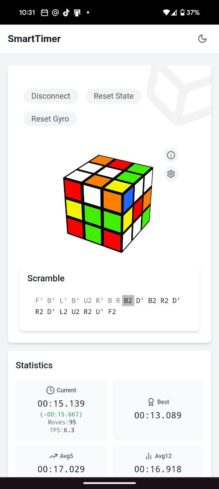
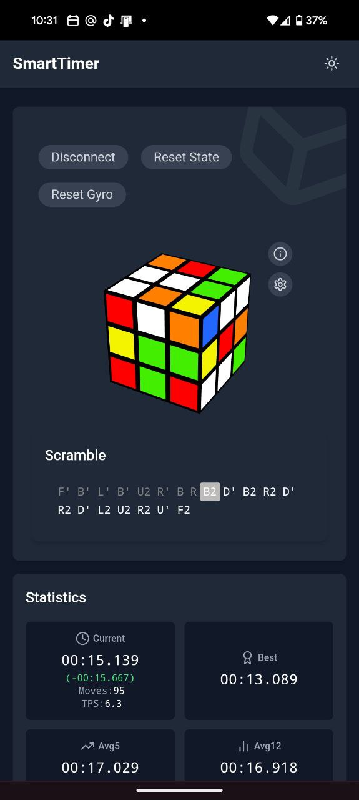
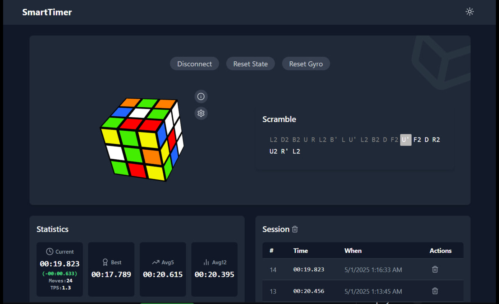
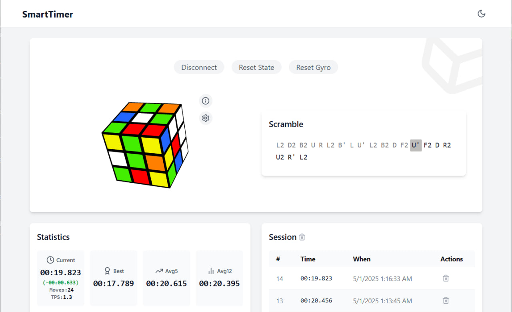

# 🚀 Smart Cube Timer  
*A modern [PWA](https://en.wikipedia.org/wiki/Progressive_web_app) speedcubing timer with smart GAN cube support*

[](https://sheshkon.github.io/smart-cube-timer/)

<div align="center">
  
   
  
  *Fig 1. Timer Mobile interface in dark/light modes*
</div>

<div align="center">
  
    
  
  *Fig 2. Timer Desktop interface in dark/light modes*
</div>

## ✨ Features

### ⏱️ Core Timer
- Millisecond-accurate timing
- 3D visualization

### 🤖 Smart Cube Support
- Bluetooth connectivity (GAN)
- Real-time move tracking
- Move-per-second analytics
- Reconstruction of moves

### 📊 Analytics Dashboard
- Session averages (Ao5, Ao12)
- Personal best tracking

### 🎨 Customization
- Light/dark mode
- Adjustable scramble sizes
- Enable/disable giroscope

## 🛠️ Tech Stack

| Category       | Technologies |
|----------------|-------------|
| Frontend       | React, Vite, TypeScript |
| Styling        | Tailwind CSS, CSS Modules |
| State          | Context API, Zustand |
| 3D Rendering   | Three.js |
| Bluetooth      | Web Bluetooth API |
| Deployment     | GitHub Pages |

## 🚀 Getting Started

```bash
git clone https://github.com/sheshkon/smart-cube-timer.git
cd smart-cube-timer
npm install
npm run dev
