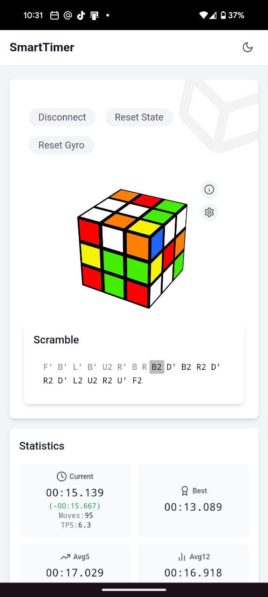
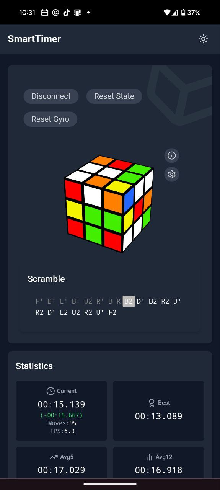
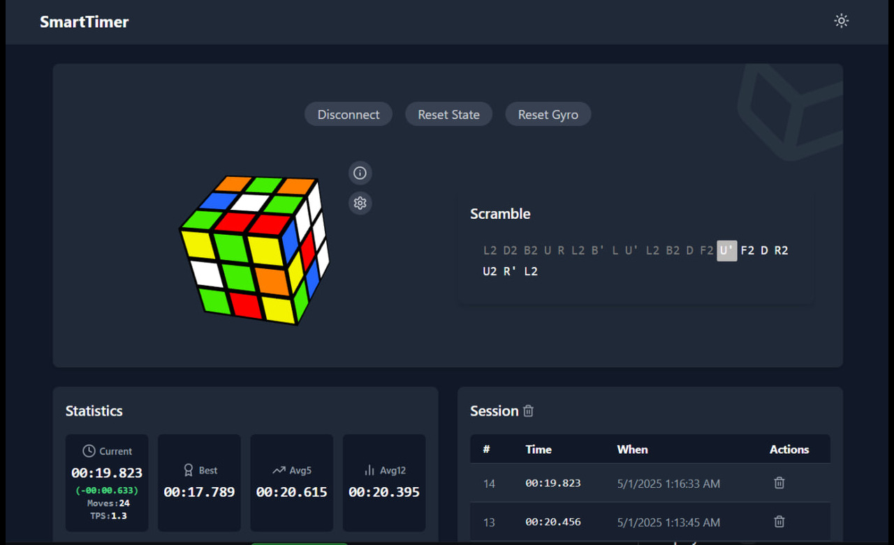
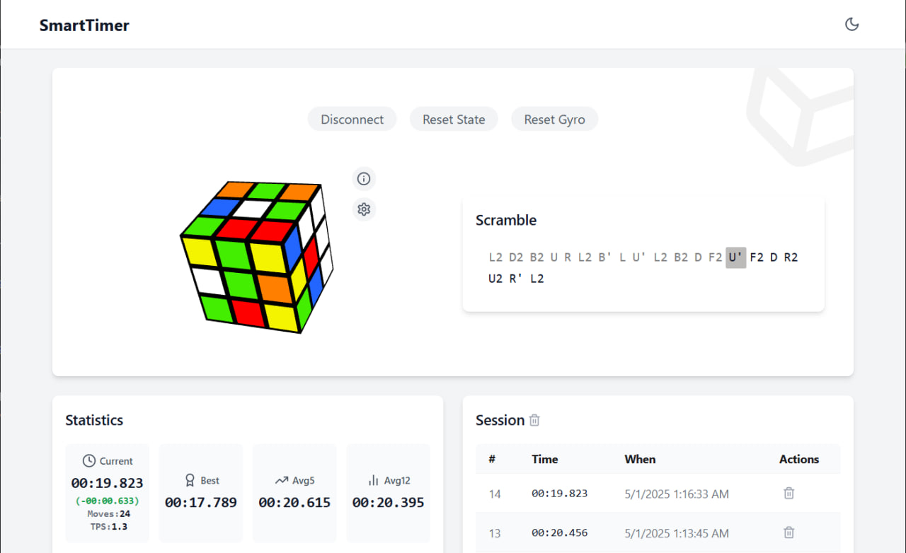

# 🚀 Smart Cube Timer  
*A modern [PWA](https://en.wikipedia.org/wiki/Progressive_web_app) speedcubing timer with smart GAN cube support*

[](https://sheshkon.github.io/smart-cube-timer/)


## 🎥 Demo Video


https://github.com/user-attachments/assets/2a34bef8-572a-4cdf-a49e-a67b4a32b0aa


<!-- 
<div align="center">
  
  
  
  <em>Fig 1. Mobile interface (Light/Dark/Stats)</em>
</div>

<div align="center">
  
  
  
  <em>Fig 2. Desktop interface (Dark/Light/Extended Statistics)</em>
</div>

<div align="center">
  
  
  
  <em>Fig 3. Key Features: Connection, Analysis, Sharing</em>
</div>
-->
## ✨ Features

### ⏱️ Core Timer
- Millisecond-accurate timing with inspection period
- 3D cube visualization with solve reconstruction
- Multi-phase timing (inspection/solving/recognition)

### 🤖 Smart Cube Integration
- Bluetooth LE connectivity for Smart Cubes
- Real-time move tracking with move-per-second analytics
- Automatic method detection (CFOP, Roux)
- Battery level monitoring

### 📊 Advanced Analytics
- **Session Statistics**:
  - Averages (Ao5, Ao12, Ao100)
  - Personal best tracking with historical trends
  - Time distribution charts
- **Extended Statistics**:
  - Solve time breakdown by cube state
  - Move efficiency analysis
  - Comparison between sessions

### 🔗 Sharing Features
- Generate shareable links for specific solves
- QR code generation for quick sharing
- Social media integration
- Export/Import sessions data

### 🎨 Customization
- Light/dark modes
- Gyroscope controls toggle
- inspection toggle
- image move notation

## 🙏 Big thanks 
[Library for interaction with Smart Cubes on the platforms that support Web Bluetooth API](https://github.com/afedotov/gan-web-bluetooth)

### Supported Smart Cube devices:
- GAN Gen2 protocol smart cubes:
- GAN Mini ui FreePlay
- GAN12 ui FreePlay
- GAN12 ui
- GAN356 i Carry S
- GAN356 i Carry
- GAN356 i 3
- Monster Go 3Ai
- MoYu AI 2023 (this cube uses GAN Gen2 protocol)
- GAN Gen3 protocol smart cubes:
- GAN356 i Carry 2
- GAN Gen4 protocol smart cubes:
- GAN12 ui Maglev
- GAN14 ui FreePlay
  
## 🛠️ Tech Stack

| Category       | Technologies |
|----------------|--------------|
| Frontend       | React 18, Vite 5, JavaScript |
| State          | React Providers |
| Styling        | Tailwind CSS 3 |
| 3D             | Three.js, Twisty Player |
| Bluetooth      | Web Bluetooth API |
| Charts         | React Charts |
| PWA            | Workbox, Offline caching |
| Deployment     | GitHub Pages |

## 🚀 Getting Started

### Prerequisites
- Chrome/Edge 89+ (for Web Bluetooth)
- Enable flags: `chrome://flags/#enable-experimental-web-platform-features`
- Bluetooth enabled device

## ℹ️ Compatibility Notes

### iOS Limitations
⚠️ **Mobile iOS devices (iPhone/iPad) are currently not supported** due to:
- Apple's restrictive Web Bluetooth implementation
- Missing BLE (Bluetooth Low Energy) peripheral mode in mobile Safari
- Lack of Web Bluetooth API support in WKWebView

**Workarounds:**
1. Use **macOS devices** (MacBook, iMac) with Chrome/Edge
2. Android devices with Chrome 89+
3. For development: Use iOS with [WebBLE polyfill](https://github.com/WebBluetoothCG/web-bluetooth-polyfill) (limited functionality)

We're monitoring [WebKit's Web Bluetooth status](https://webkit.org/status/#specification-web-bluetooth) for future iOS support.

### Installation
```bash
git clone https://github.com/sheshkon/smart-cube-timer.git
cd smart-cube-timer
npm install
npm run dev
